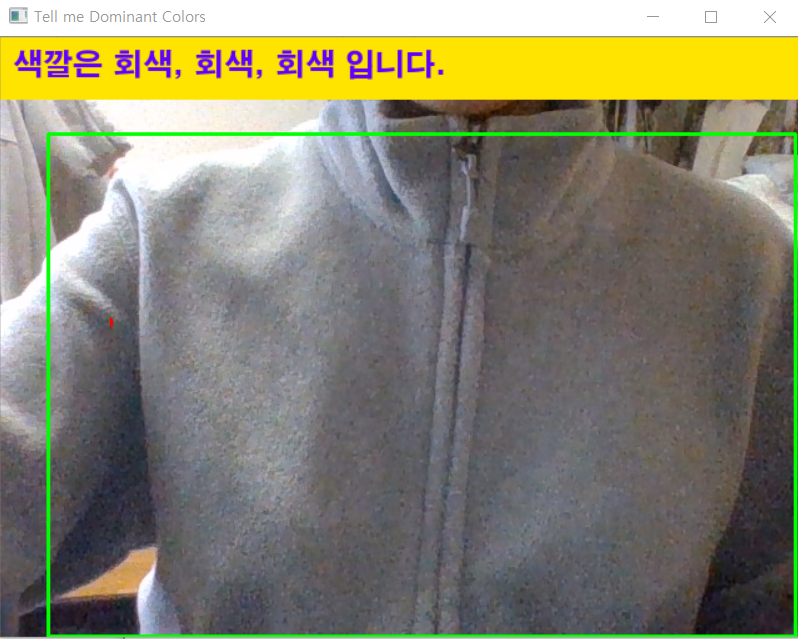
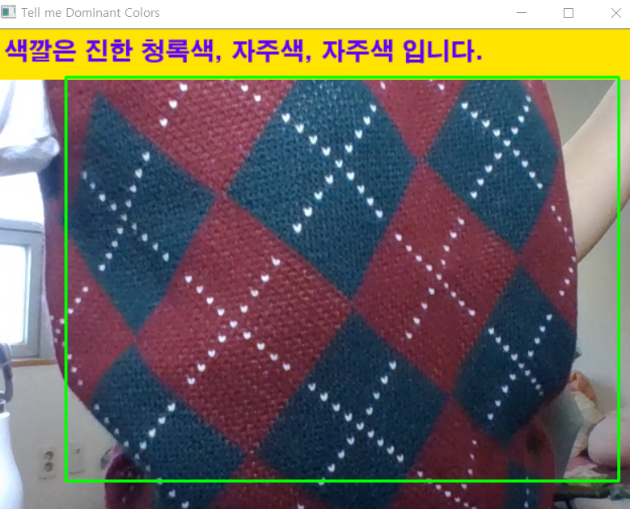
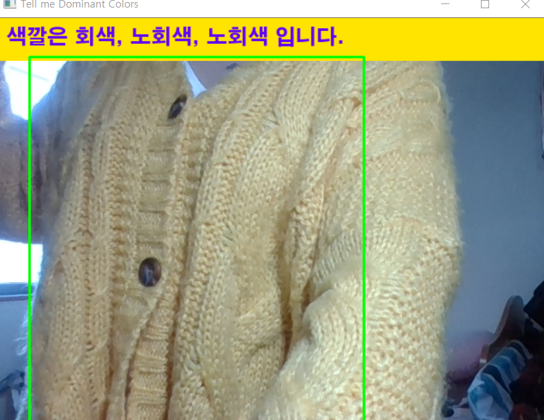
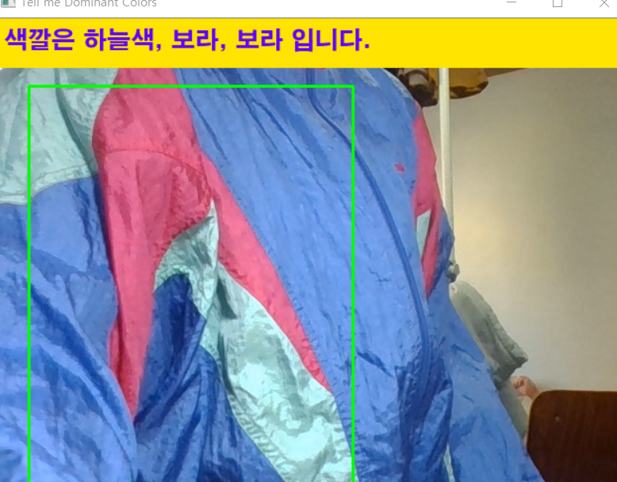

# 👕 옷 색상 및 패턴 실시간 인식 프로그램
시각장애인을 위한 옷 색상 및 패턴 실시간 인식 프로그램입니다. 이 프로젝트는 시각장애인이 옷의 색상과 패턴을 인식하는 데 도움을 주기 위해 개발되었습니다.
 
 
 
# 🧠 프로젝트 개요
 - 목표: 시각장애인이 옷의 색상과 패턴을 실시간으로 인식할 수 있도록 지원하는 프로그램 개발
 
 
 
## 기술 스택:
Python, OpenCV, 머신러닝 기반 색상 및 패턴 분석
 
 
 
## 주요 기능:
이미지에서 주요 색상 추출 및 분석
옷의 패턴 인식 (예: 스트라이프, 도트 등)
시각적 결과 출력 및 향후 음성 안내 기능 확장 가능성
 
 
 
# 📁 프로젝트 구조
📦 Graduation-portfolio 
├── 📁 the_Last.zip 
│   └── Tell_me_Dominant_Colors.py         # 최종 실행 코드 (TensorFlow Object Detection 디렉토리 안에서 실행해야 함) 
│   📌 코드 내 색상 DB 경로 수정 필요 
│ 
├── 📁 DB.zip 
│   ├── rgb.txt                            # 원본 색상 DB 
│   ├── RGB_REAL.txt                       # 회색 계열 삭제 및 중복 제거 버전 
│   └── RGB_REAL_KR.txt                    # 한글 패치된 색상 DB 
│ 
├── 📁 Domi_Cols.zip 
│   ├── 3_Dominant_Color_Photo_ver/        # 이미지 선택 방식 (사진 기반) 
│   │   └── 3_Dominant_Color_Photo_ver_USAGE.txt  # 사용 방법 설명 
│   ├── 3_Dominant_Color_Webcam_ver/       # 웹캠 실시간 분석 
│   └── 3_Dominant_Color_Webcam_KR_ver/    # 한글 인터페이스 웹캠 버전 
│   📌 실행 전 코드 내에서 RGB_REAL.txt / RGB_REAL_KR.txt 의 경로 수정 필요 
│   📌 Photo ver.은 이미지 선택 방법 설명서 참조: 3_Dominant_Color_Photo_ver_USAGE.txt 
│ 
├── 📄 result1.png                          # 프로그램 실행 캡처본 
├── 📄 result2.png 
├── 📄 result3.png 
├── 📄 result4.png 
├── 📄 README.md                            # 프로젝트 소개 및 사용 방법 
└── 📄 READ_ME.txt                          # 원본 설명 텍스트 
 
 
 
# 🚀 시작하기 
### 레포지토리를 클론합니다:
`git clone https://github.com/AlmightyDenver/Graduation-portfolio.git`

### 필요한 패키지를 설치합니다:
`pip install -r requirements.txt`

### Tell_me_Dominant_Colors.py를 실행하여 주요 색상 추출 기능을 테스트합니다.
 
### 🔍 3_Dominant_Color_Webcam_ver.py 사용 시 유의사항

- `RGB_REAL.txt` 또는 `RGB_REAL_KR.txt` 파일이 필요합니다.
- 코드 내 해당 경로는 사용자의 실행 환경에 맞게 수정해주세요.
- 고대비 시각적 안내를 위해 `H2GTRE.TTF` 폰트 파일이 필요합니다 (폰트는 `/fonts` 폴더에 위치).
- 실행 중 `q` 키를 누르면 프로그램이 종료됩니다.
 
 
 
# 🖼️ 결과 예시
프로그램 실행 결과 예시 이미지는 다음과 같습니다:

 
 
 
# 📌 향후 개선 사항
다양한 패턴 인식 기능 추가
음성 안내 기능 통합
모바일 애플리케이션으로의 확장
 
 
 
